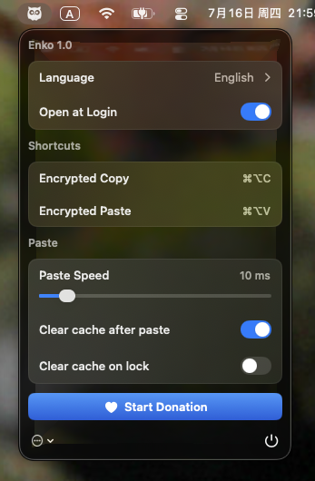

  
  <h2 align="center">Enko</h2>
  <h4 align="center">Encrypted clipboard for macOS</h4>
  

    
    
  

### Enko

Enko is an encrypted clipboard tool for macOS. Unlike similar apps that briefly use the system clipboard as a transfer channel, Enko follows an end-to-end self-managed flow for copy and paste with no external exposure during the process. The trade-off is weaker compatibility with some non-native apps, but this provides stronger security.

### Screenshot

### Download

[https://github.com/potor-com/Enko/releases](https://github.com/potor-com/Enko/releases)

### System Requirements

macOS 14+
